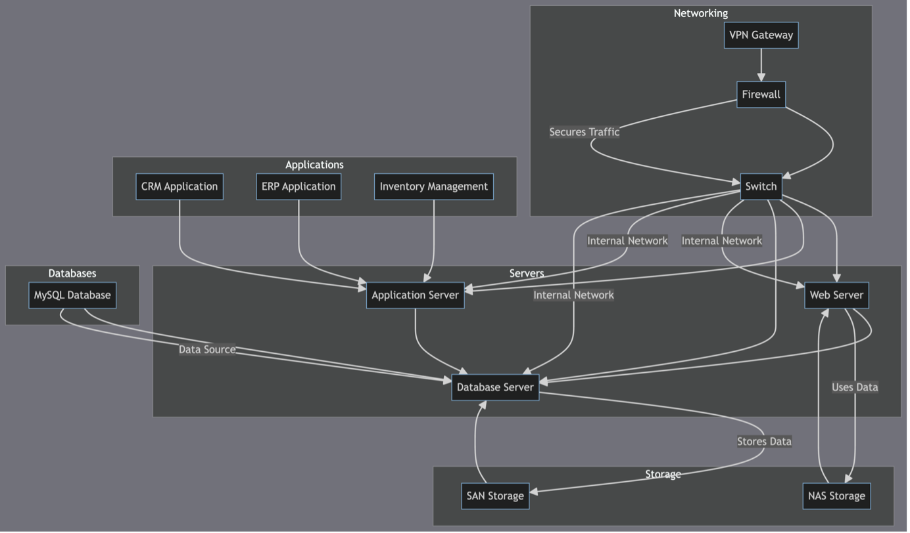
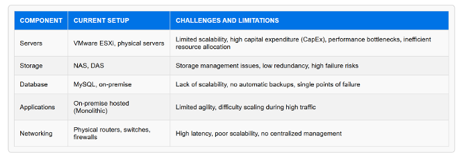
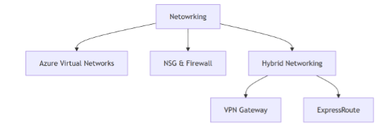
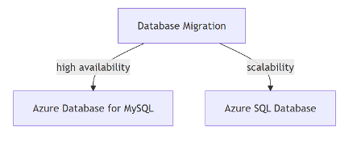
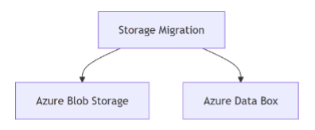
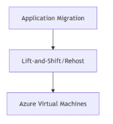
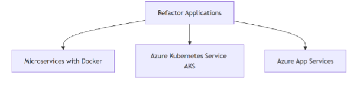
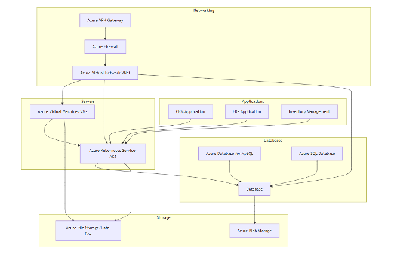
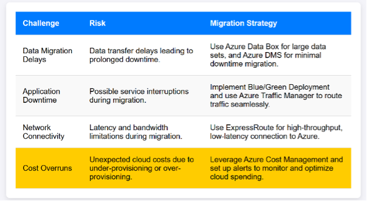
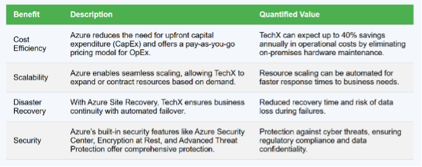

# Introduction-to-cloud--Project
# On Premise to Cloud - Technical Report

         
# TechX Cloud Migration Strategy

## 1. Executive Summary
TechX, a mid-sized technology company, aims to migrate its on-premise IT infrastructure to Microsoft Azure in response to its growing business needs. This transition will not only improve scalability and reduce costs but also enable enhanced operational efficiency through Azure's advanced services (Sairam Madasu, n.d.). The migration strategy includes the use of Azure Virtual Machines (VMs), Azure Kubernetes Service (AKS), Azure SQL Database, Azure Blob Storage, and other Azure-native tools, ensuring a smooth transition while meeting TechX’s goals of performance optimization, cost savings, and increased flexibility.

## 2. Current State Analysis

### 2.1. TechX’s Existing IT Infrastructure
TechX, a mid-sized technology company, operates using on-premise IT infrastructure to support its current business operations. The infrastructure comprises VMware ESXi virtualized physical servers, Network-Attached Storage (NAS) and Direct-Attached Storage (DAS), MySQL databases, and monolithic on-premise-hosted applications. Networking relies on physical routers, switches, and firewalls. As the company experiences growth, it aims to enhance scalability, reduce operational costs, and improve overall efficiency to better align with its strategic goals.

#### On-prem HLD
 

*Figure shows the on-premise setup of Tech-X.*

TechX currently operates with the following setup:
 

To address these limitations, TechX plans to migrate to the cloud to leverage advanced features like elasticity, cost-efficiency, and improved reliability. The goal is to modernize the IT landscape, minimize operational risks, and support the company’s growth trajectory while ensuring minimal disruption to ongoing business processes (Sairam Madasu, n.d.).

#### Key Challenges:
- **Scalability**: TechX’s current setup struggles with scaling resources to meet growing demand, causing performance degradation during peak periods.
- **Cost Inefficiency**: The heavy upfront capital costs of hardware and ongoing operational expenses are unsustainable.
- **Disaster Recovery Risks**: The on-premise infrastructure lacks comprehensive backup and recovery strategies, posing a risk to business continuity.
- **Operational Constraints**: The legacy infrastructure is difficult to manage and unable to support modern workloads, such as containerized applications.

## 3. Migration Strategy and Azure Tools

### 3.1. Migration Methodology
TechX’s migration to Azure will be based on the 5 R’s of Cloud Migration (Tester. M, Demystifying the 5 R’s of Rationalization, 2023), each of which addresses different types of workloads and use cases for transitioning to the cloud:

| **R Strategy**  | **Description**                                                    | **Azure Service Example**  |
|-----------------|--------------------------------------------------------------------|----------------------------|
| Rehost          | Lift-and-shift migration, moving applications as-is.              | Azure Virtual Machines (VMs) |
| Replatform      | Migrate applications with minimal changes to take advantage of cloud features. | Azure Database for MySQL and Azure SQL Database |
| Refactor        | Refactor applications to cloud-native architecture (microservices, containers). | Azure Kubernetes Service (AKS) and Azure Functions |
| Repurchase      | Replace legacy systems with cloud-based SaaS solutions.            | Microsoft 365, Dynamics 365 |
| Retire          | Decommission outdated applications and hardware.                   | N/A                        |

### 3.2. Azure Tools for Migration
TechX will leverage the following Azure tools and services (Gudimetla Sandeep, 2017) to ensure a smooth and efficient migration process:
- **Azure Migrate**: A comprehensive tool for assessing and migrating on-premise workloads to Azure. Azure Migrate helps in discovering and assessing applications, databases, and servers to determine the best migration approach.
- **Azure Site Recovery**: Ensures business continuity by replicating workloads to Azure and providing failover capabilities during migration. It minimizes downtime and ensures disaster recovery in case of failure (Gudimetla Sandeep, 2017).
- **Azure Database Migration Service (DMS)**: A fully managed service for migrating databases from on-premise environments to Azure. DMS supports various databases, including MySQL and SQL Server, providing near-zero downtime migration (Boddapati, Sarisa, Reddy, Sunkara, Rajaram, Bauskar, & Polimetla, 2024).
- **Azure Blob Storage**: Ideal for storing large volumes of unstructured data such as backups, logs, or media files. It offers cost-efficient storage with multiple access tiers.
- **Azure Resource Manager (ARM)**: Helps in organizing and managing cloud resources efficiently using infrastructure-as-code principles, enabling consistent, repeatable deployments.

## 4. Migration Phases

### 4.1. Phase 1: Assessment and Planning

#### 4.1.1 Infrastructure Assessment:
- Use **Azure Migrate** to assess on-premise VMs, applications, and databases (Gudimetla Sandeep, 2017). The assessment will analyze workload compatibility, identify dependencies, and provide recommendations for instance sizing on Azure.
- Perform cost analysis and create a migration roadmap that includes timelines, resource requirements, and risk assessments.

#### 4.1.2 Design Cloud Architecture:
- Design a cloud-based network infrastructure using **Azure Virtual Networks (VNets)** for secure, isolated environments. Use of subnets, network security groups (NSGs), and **Azure Firewall** to ensure secure connectivity.
- Hybrid networking options using **VPN Gateway** or **ExpressRoute** to ensure secure and high-speed connectivity between on-premise and Azure environments.
 

*Figure shows the proposed cloud networking for Tech-X.*

### 4.2. Phase 2: Data Migration

#### 4.2.1 Database Migration:
- Migrate on-premise MySQL databases to **Azure Database for MySQL** using **Azure Database Migration Service (DMS)** (Boddapati et al., 2024). This service handles schema conversion, data migration, and synchronization to minimize downtime during the transition.
- TechX’s mission-critical databases will be moved to **Azure SQL Database**, a fully managed service offering high availability, scalability, and security features.
 

*Figure shows the proposed database migration.*

#### 4.2.2 Storage Migration:
- Migrate large datasets (e.g., application logs, backups, and archives) from on-premise NAS to **Azure Blob Storage**. This will provide scalable, cost-efficient storage with multiple access tiers (hot, cool, and archive) (Valiramani & Microsoft Corporation, 2024).
- For large-scale data transfers, **Azure Data Box** can be used to physically transfer data to Azure when network bandwidth is limited.
 

*Figure shows the proposed storage migration.*

### 4.3. Phase 3: Application Migration and Refactoring

#### 4.3.1 Lift-and-Shift (Rehost)
- Move on-premise applications like legacy CRM and ERP systems directly to **Azure Virtual Machines (VMs)** with minimal changes. These applications will benefit from Azure’s flexibility and scalability (Valiramani et al., 2024).
- TechX’s on-premise email servers will also be moved to Azure VMs to maintain operations during the migration phase.
 
 
*Figure shows the proposed application migration.*

#### 4.3.2 Refactor Applications
- Refactor monolithic applications, such as TechX’s e-commerce platform, by splitting them into microservices. Each microservice will be containerized using Docker and orchestrated using **Azure Kubernetes Service (AKS)** for enhanced scalability and management (Muzumdar, Bhosale, Basyal, & Kurian, 2024).
- Use **Azure App Services** for web-based applications that require auto-scaling and PaaS management.
 
*Figure shows the proposed refactoring of monolithic applications.*

### Migrated HLD
 
*Figure shows the HLD of migrated Tech-X setup.*

#### Networking (Azure VPN Gateway, Azure Firewall, Azure Virtual Network)
Azure Virtual Network (VNet) enables secure communication between components like VMs, AKS, and databases. The Azure VPN Gateway ensures secure, high-speed hybrid connectivity between on-premise and cloud environments. Azure Firewall protects inbound and outbound traffic, securing the cloud infrastructure and minimizing unauthorized access risks.

#### Applications (CRM, ERP, Inventory Management)
Core business applications like CRM, ERP, and Inventory Management are containerized using Azure Kubernetes Service (AKS), enabling scalable microservices. AKS reduces infrastructure complexity while allowing flexible and efficient management of the applications.

#### Databases (Azure Database for MySQL, Azure SQL Database)
Azure Database for MySQL and Azure SQL Database provide managed, scalable database services with automatic backups, security, and high availability. These services reduce administrative overhead and enhance performance, ensuring minimal downtime and cost-efficiency.

#### Servers (Azure Virtual Machines, Azure Kubernetes Service)
Azure Virtual Machines (VMs) host legacy applications that require minimal changes, offering flexibility in configuration and performance. Azure Kubernetes Service (AKS) orchestrates containerized applications, enabling microservices architecture, efficient resource management, and improved scalability.

#### Storage (Azure Blob Storage, Azure File Storage/Data Box)
Azure Blob Storage offers cost-effective storage for unstructured data, with multiple access tiers to optimize costs. Azure File Storage provides a fully managed file share, and Azure Data Box helps transfer large datasets when network bandwidth is limited (Valiramani & Microsoft Corporation, 2024).

# 5. Utilization of Cloud Services

Microsoft Azure is selected as the cloud provider due to its scalability, security, and cost-efficiency. Azure's services will support TechX's migration and cloud optimization strategy.

## 1. Azure Kubernetes Service (AKS)
AKS will be used to containerize and orchestrate applications, allowing TechX to scale its e-commerce platform, CRM, ERP, and Inventory Management systems as microservices. Integrated with Azure DevOps for CI/CD, AKS ensures seamless deployment and management of these refactored applications (Awati, Gillis, & Bigelow, 2024). It also allows TechX to efficiently manage the lifecycle of containers while reducing operational overhead.

## 2. Azure Virtual Machines (VMs)
Azure VMs are deployed to host legacy applications such as email servers and monolithic systems that require minimal changes. The integration with Azure VPN Gateway facilitates hybrid connectivity, enabling seamless interaction between on-premise and cloud-based systems. This ensures that TechX can maintain operations during the migration phase without disrupting workflows.

## 3. Azure Database for MySQL & Azure SQL Database
Azure Database for MySQL and Azure SQL Database are used to migrate critical on-premise databases with minimal downtime (Khan, Kumar, Zhang, Raj, Roy, & Luo, 2023). Azure Database Migration Service (DMS) handles schema conversion and data synchronization, ensuring data consistency. These services integrate with VMs and AKS, ensuring that applications can access databases in the cloud while maintaining operational continuity.

## 4. Azure Blob Storage
Azure Blob Storage is ideal for storing large unstructured data like logs, backups, and archives (Valiramani & Microsoft Corporation, 2024). It offers multiple access tiers to optimize storage costs. Integration with applications hosted on AKS and VMs allows easy access to data and ensures secure storage and retrieval, supporting both operational and archival needs.

## 5. Azure File Storage & Azure Data Box
Azure File Storage provides shared file storage, while Azure Data Box helps with transferring large datasets when network bandwidth is limited. Both services integrate with applications on VMs and AKS, ensuring seamless file access and data migration during the cloud transition.

## 6. Azure VPN Gateway & Azure Firewall
Azure VPN Gateway and Azure Firewall enable secure, high-speed connectivity between on-premise and Azure environments. VPN Gateway supports hybrid networking, while Azure Firewall ensures security (Network Architecture Security Analysis for Azure, 2024), controlling traffic between the on-premise network and Azure cloud. These services integrate with Azure Virtual Network (VNet) to provide a secure and scalable network infrastructure.

# 6. Data Storage, Processing, and Security Protocols

For TechX's data storage, processing, and security protocols, a multi-layered approach is adopted to ensure efficient handling and security of data. The components outlined in the architecture use a combination of Azure services and industry best practices to meet security, scalability, and compliance requirements.

## 6.1 Data Storage Protocols

Azure provides robust and scalable storage solutions for different types of data, from structured to unstructured.

1. **Azure Blob Storage** is utilized for storing large unstructured data, such as backups, application logs, and media files. It supports various access tiers (Hot, Cool, and Archive) for optimizing costs based on access frequency. The data is encrypted at rest using Azure Storage Service Encryption (SSE) and in transit using HTTPS. For more secure and scalable solutions, **Azure Files** is employed for file shares, with built-in security features like SMB 3.0 and encryption at rest (Valiramani et al., 2024).

2. **Azure Database for MySQL** and **Azure SQL Database** are used for relational database management. Both services support Transparent Data Encryption (TDE) to encrypt the data at rest and Always Encrypted to safeguard sensitive data by encrypting it before storing it in the database (Khan et al., 2023). In transit, both services use SSL/TLS to ensure encrypted communication. Additionally, Advanced Threat Protection and Audit Logs help in monitoring and identifying potential vulnerabilities.

3. **Azure Data Box** is used for transferring large amounts of data to Azure when network bandwidth is limited, ensuring secure and offline transfers. It uses hardware-level encryption to protect data while in transit.

## 6.2 Data Processing Protocols

Data processing is carried out efficiently with Azure’s services, which include integration pipelines, analytics, and artificial intelligence components.

1. **Azure Kubernetes Service (AKS)** handles containerized applications and microservices. It provides efficient orchestration, scaling, and management of applications, ensuring the processing of high-demand workloads with minimal downtime (Awati et al., 2024). AKS integrates with Azure Container Registry for secure storage of container images, while encryption is handled at multiple levels using KMS (Key Management Service) and Azure Managed Identity for secure access.

2. **Azure Logic Apps** and **Azure Functions** are used for orchestrating workflows and triggering data processing tasks based on events, ensuring seamless automation of processes and real-time data handling. The data is processed in line with GDPR (General Data Protection Regulation) and ISO/IEC 27001 certifications for compliance.

3. **Data Pipelines** for analytics and machine learning are set up using **Azure Data Factory** (Borra, 2024). This service helps in integrating different data sources, performing ETL (Extract, Transform, Load) operations, and ensuring that sensitive data is handled securely by leveraging Azure Key Vault for storing encryption keys and credentials.

## 6.3 Security Protocols

Security is a critical aspect of TechX’s architecture, implemented through multiple layers of defense to protect data both at rest and in transit.

1. **Identity and Access Management (IAM)** is enforced using **Azure Active Directory (Azure AD)** for centralized authentication and access control (Obregon, 2024). Multi-Factor Authentication (MFA) is applied for added security, especially for administrators and users accessing sensitive resources. Role-Based Access Control (RBAC) ensures that only authorized individuals have access to specific services or resources.

2. **Azure Key Vault** manages encryption keys, secrets, and certificates. Sensitive information like connection strings and passwords are stored in the vault, reducing the risk of exposing credentials in code or configuration files. Key Rotation policies are implemented for added security, ensuring that cryptographic keys are periodically rotated (Valiramani et al., 2024).

3. **Azure Firewall** and **Azure VPN Gateway** provide network security by securing the communication between on-premise and Azure environments. The VPN Gateway ensures secure hybrid connectivity, while the Firewall monitors and controls traffic flow, protecting applications from external threats (Network Architecture Security Analysis for Azure, 2024). Additionally, **Web Application Firewall (WAF)** is deployed to defend web applications from common exploits like SQL injection and cross-site scripting.

4. Encryption is implemented at every level from file storage and database encryption to data transmission. TLS 1.2+ is used for encrypting data in transit, while Advanced Encryption Standard (AES-256) is employed for data at rest, ensuring compliance with high-security standards (Network Architecture Security Analysis for Azure, 2024).

## 6.4 Compliance Considerations

Given that TechX operates in the technology consulting industry, maintaining compliance with relevant regulations is crucial. Several Azure compliance certifications (Seth, Najana, & Ranjan, 2024) are leveraged to meet industry requirements:

1. **General Data Protection Regulation (GDPR):** Data handling processes are designed to comply with GDPR, ensuring that personal data is protected, processed, and stored securely. Azure’s built-in compliance tools help in managing data subject requests and audit logs.

2. **ISO/IEC 27001:** TechX adheres to the ISO 27001 standards for information security management, ensuring that security risks are effectively managed through documented processes and security measures (Stevevi, 2023).

3. **Health Insurance Portability and Accountability Act (HIPAA):** For any sensitive healthcare-related data, Azure provides HIPAA-compliant services, with encryption and access controls in place to ensure patient data protection.

4. **Federal Risk and Authorization Management Program (FedRAMP):** For clients in the public sector, Azure provides FedRAMP-compliant services, ensuring the protection of federal data in the cloud.

# 7. Cloud Deployment Model

A **Hybrid Cloud Deployment Model** is the optimal choice for TechX, offering a balance between flexibility, data security, and compliance. This model combines the scalability of the public cloud with the control of the private cloud, addressing TechX’s diverse needs.

## Data Sensitivity and Compliance
TechX handles sensitive data that requires secure management. The hybrid model enables sensitive data to be stored in the private cloud, ensuring enhanced security, while leveraging the public cloud for non-sensitive data, optimizing scalability. This approach also meets compliance requirements like GDPR and HIPAA by keeping regulated data in the private cloud while using the public cloud for less regulated workloads.

## Strategic Goals
From a strategic standpoint, TechX seeks to optimize its infrastructure for scalability and flexibility. The hybrid cloud model provides the ability to scale workloads quickly with public cloud resources during peak demand while keeping critical applications and data management within a private cloud environment for optimal security and control. The ability to shift workloads between public and private clouds as needed allows TechX to align its cloud infrastructure with evolving business goals and market demands, ensuring it remains agile and cost-effective.

# 8. Resource Optimization Strategies

## Resource Optimization Strategies for TechX
Effective resource optimization is essential for minimizing cloud costs, improving performance, and ensuring scalability for TechX’s cloud infrastructure. Below are the strategies employed for optimizing instances, storage, and networking, along with automation and scaling policies that ensure resource utilization remains optimal (The Ultimate guide to Azure cost optimization, 2024).

### 8.1 Instance Optimization
- **Right-Sizing**: Instances will be selected based on the specific workloads, ensuring they are appropriately sized for performance without over-provisioning. Azure VM Scale Sets will be used to automatically adjust the number of virtual machines (VMs) based on demand.
- **Spot Instances**: For non-critical workloads or batch processing, Azure Spot VMs will be used. These are lower-cost instances that can be terminated by Azure with little notice, optimizing cost for tasks that are not time-sensitive.
- **Auto-scaling**: Azure Autoscale will be configured to automatically increase or decrease the number of virtual machines or application instances based on CPU, memory, or custom-defined metrics. This ensures that TechX’s infrastructure adapts to traffic spikes and low demand efficiently.

### 8.2 Storage Optimization
- **Data Tiering**: Azure Blob Storage will be used with access tiers (Hot, Cool, Archive) to optimize costs based on data access frequency. Frequently accessed data will be placed in the Hot tier, while infrequently accessed data, like backups, will be stored in the Cool or Archive tiers to reduce storage costs.
- **Data Lifecycle Management**: Azure Blob Lifecycle Management policies will be set to automatically move data between different storage tiers or delete data that is no longer needed, ensuring continuous cost optimization and compliance with data retention policies.
- **Storage Compression and Deduplication**: For backup and archival storage, Azure File Storage will use data compression and deduplication techniques to reduce the storage footprint, enhancing storage efficiency and reducing costs.

### 8.3 Networking Optimization
- **Virtual Network Peering and Subnetting**: By using Azure Virtual Network Peering, different regions or network segments can be connected securely and efficiently, minimizing data transfer costs while maintaining low-latency communication between resources.
- **Optimizing Bandwidth Usage**: Azure ExpressRoute will be utilized for high-throughput, low-latency connections between on-premise and Azure environments. This will help optimize networking performance, especially for large data transfers, while also minimizing dependency on the public internet.
- **Traffic Management with Load Balancers**: Azure Load Balancer and Azure Traffic Manager will ensure optimal distribution of traffic across resources, minimizing bottlenecks and improving application responsiveness. This will allow TechX to scale applications efficiently and maintain high availability.

### 8.4 Automation and Scaling Policies
- **Automation of Resource Management**: Azure Automation will be utilized for repetitive tasks such as patch management, scaling, and resource optimization. Runbooks will be created to automate instance resizing and shutdown during off-peak hours, ensuring cost savings during idle periods.
- **Auto-scaling Policies for Applications**: Using Azure Kubernetes Service (AKS) (Awati et al., 2024), auto-scaling policies will be configured to scale containerized applications based on metrics like CPU and memory usage. This ensures that applications can automatically scale up or down in response to workload demand, maintaining performance and cost efficiency.
- **Dynamic Scaling of Databases**: For databases, Azure SQL Database and Azure Database for MySQL (Khan et al., 2023) will be configured with auto-scaling capabilities, automatically adjusting compute resources and storage as needed based on workload variations, thereby optimizing resource utilization and cost efficiency.

### 8.5 Performance Monitoring
- **Use Azure Monitor and Application Insights** to track the health, performance, and usage of cloud resources. This data will allow TechX to continuously optimize performance and identify areas for improvement.
- **Set up Azure Auto-Scale** for virtual machines and Kubernetes clusters to handle varying workloads without manual intervention, ensuring optimal performance during traffic spikes.

# 9. Risk Management and Mitigation Strategies
 
Figure shows the risk mitigation strategies for TechX.  
The key migration challenges include data migration delays, application downtime, network connectivity, and cost overruns. To mitigate data transfer delays, Azure Data Box and Azure DMS are utilized for efficient data migration with minimal downtime. Blue/Green Deployment and Azure Traffic Manager are implemented to ensure seamless application traffic routing and minimize downtime. ExpressRoute offers high-throughput, low-latency connectivity to Azure, overcoming network latency and bandwidth limitations. To avoid cost overruns, Azure Cost Management tools are used to monitor, alert, and optimize cloud spending, ensuring proper provisioning and budget control during migration (Gluckd, 2024).

# 10. Benefits of Cloud Migration with Azure
 
Figure explains the benefits of using Azure Cloud Services.  
Azure offers significant benefits for TechX, including cost savings through a pay-as-you-go model, scalable resources that adjust based on demand, and enhanced disaster recovery with automated failover to ensure business continuity. Its built-in security features, such as encryption and advanced threat protection, safeguard against cyber threats while ensuring compliance with regulatory standards. These capabilities help TechX reduce operational costs, improve performance, and ensure a secure and resilient IT environment (Madasu, n.d.).

# 11. References
1. Madasu, S. (n.d.). Acceleration, Migration, and Modernization with Azure and Its Impact in Modern Business. *International Journal of Health, Physical Education and Computer Science in Sports*, 48, 1-4.
2. Tester, M. (2023, March 18). Azure Cloud Migration: Demystifying the 5 R’s of Rationalization. *Matt Tester*. [https://matthewtester.com/posts/the-5-rs-of-cloud-rationalisation](https://matthewtester.com/posts/the-5-rs-of-cloud-rationalisation)
3. Gudimetla, Sandeep. (2017). Azure Migrations Unveiled - Strategies for Seamless Cloud Integration. *NeuroQuantology*, 15, 117-123. [10.48047/nq.2017.15.1.1017](https://doi.org/10.48047/nq.2017.15.1.1017)
4. Boddapati, V. N., Sarisa, M., Reddy, M. S., Sunkara, J. R., Rajaram, S. K., Bauskar, S. R., & Polimetla, K. (2024). Data Migration in the Cloud Database: A review of Vendor solutions and challenges. *SSRN Electronic Journal*. [https://doi.org/10.2139/ssrn.4977121](https://doi.org/10.2139/ssrn.4977121)
5. Valiramani, A. & Microsoft Corporation. (2024). *Microsoft Azure Storage: The Definitive Guide*. Pearson Education, Inc. [https://ptgmedia.pearsoncmg.com/images/9780137593187/samplepages/9780137593187_Sample.pdf](https://ptgmedia.pearsoncmg.com/images/9780137593187/samplepages/9780137593187_Sample.pdf)
6. Muzumdar, P., Bhosale, A., Basyal, G. P., & Kurian, G. (2024). Navigating the Docker ecosystem: A comprehensive taxonomy and survey. *Asian Journal of Research in Computer Science*, 17(1), 42-61. [https://doi.org/10.9734/AJRCOS/2024/v17i1411](https://doi.org/10.9734/AJRCOS/2024/v17i1411)
7. Khan, W., Kumar, T., Zhang, C., Raj, K., Roy, A. M., & Luo, B. (2023). SQL and NoSQL Database Software Architecture Performance Analysis and Assessments—A Systematic Literature Review. *Big Data and Cognitive Computing*, 7(2), 97. [https://doi.org/10.3390/bdcc7020097](https://doi.org/10.3390/bdcc7020097)
8. Awati, R., Gillis, A. S., & Bigelow, S. J. (2024, April 26). Azure Kubernetes Service (AKS). *Cloud Computing*. [https://www.techtarget.com/searchcloudcomputing/definition/Azure-Kubernetes-Service-AKS](https://www.techtarget.com/searchcloudcomputing/definition/Azure-Kubernetes-Service-AKS)
9. Network Architecture Security Analysis for Azure. (2024). In Master’s Thesis. *FACULTY OF INFORMATICS*. [https://is.muni.cz/th/l0n74/Network_Architecture_Security_Analysis_for_Azure.pdf](https://is.muni.cz/th/l0n74/Network_Architecture_Security_Analysis_for_Azure.pdf)
10. Borra, Praveen, Comparative Review: Top Cloud Service Providers ETL Tools -AWS vs. Azure vs. GCP (June 04, 2024). *International Journal of Computer Engineering and Technology (IJCET)* Volume 15, Issue 3, May-June 2024, pp. 203-208, Article ID: IJCET_15_03_019 | DOI: [https://doi.org/10.17605/OSF.IO/X7WCT](https://doi.org/10.17605/OSF.IO/X7WCT), Available at SSRN: [https://ssrn.com/abstract=4914175](https://ssrn.com/abstract=4914175) or [http://dx.doi.org/10.2139/ssrn.4914175](http://dx.doi.org/10.2139/ssrn.4914175)
11. Obregon, A. (2024, February 12). A Beginner’s Guide to Azure Active Directory | Medium. *Medium*. [https://medium.com/@AlexanderObregon/beginners-guide-to-azure-active-directory-61641fd474fb](https://medium.com/@AlexanderObregon/beginners-guide-to-azure-active-directory-61641fd474fb)
12. Stevevi. (2023, May 26). ISO/IEC 27001 - Azure Compliance. *Microsoft Learn*. [https://learn.microsoft.com/en-us/azure/compliance/offerings/offering-iso-27001](https://learn.microsoft.com/en-us/azure/compliance/offerings/offering-iso-27001)
13. Spot.Io. (2024, July 30). The Ultimate guide to Azure cost optimization | Spot.io. *Spot.io*. [https://spot.io/resources/azure-cost-optimization/ultimate-guide-azure-cost-optimization/](https://spot.io/resources/azure-cost-optimization/ultimate-guide-azure-cost-optimization/)
14. Gluckd. (2024, May 17). Risk Assessment Guide for Microsoft Cloud - Microsoft Service Assurance. *Microsoft Learn*. [https://learn.microsoft.com/en-us/compliance/assurance/assurance-risk-assessment-guide](https://learn.microsoft.com/en-us/compliance/assurance/assurance-risk-assessment-guide)
